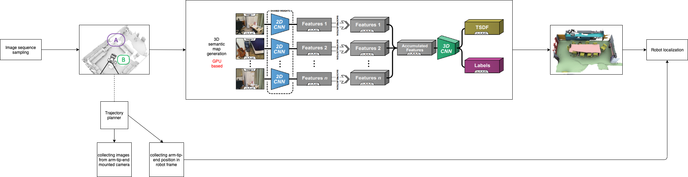

# Robotic_tasks
Potential tasks implementation for nx100-remote-control

- The inital version of 3d semantic slam pipeline

- The inital version of object grasping pipeline

## general object grasping
reinforcement learning implmentations:
- https://openaccess.thecvf.com/content_CVPR_2020/papers/Fang_GraspNet-1Billion_A_Large-Scale_Benchmark_for_General_Object_Grasping_CVPR_2020_paper.pdf
- https://graspnet.net/
- https://github.com/BarisYazici/deep-rl-grasping?ref=hackernoon.com
- https://openreview.net/pdf?id=BJZt4KywG
- https://ieeexplore.ieee.org/stamp/stamp.jsp?arnumber=9210095 

- ACRONYM: A Large-Scale Grasp Dataset Based on Simulation
https://arxiv.org/pdf/2011.09584.pdf

## 3D scene reconstruction and understanding (3D semantic)
 - https://paperswithcode.com/task/3d-scene-reconstruction
 - https://github.com/magicleap/Atlas
 
## depth object detection
Frustum VoxNet for 3D object detection from RGB-D or Depth images
- https://arxiv.org/pdf/1910.05483.pdf

Real-Time 3D Object Detection on Mobile Devices with MediaPipe
- https://ai.googleblog.com/2020/03/real-time-3d-object-detection-on-mobile.html

Vision‑based robotic grasping from object localization, object pose estimation to grasp estimation for parallel grippers: a review
- https://sci-hub.st/https://link.springer.com/article/10.1007/s10462-020-09888-5

